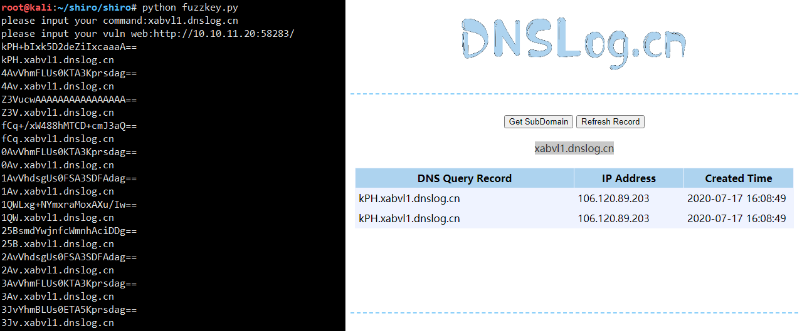
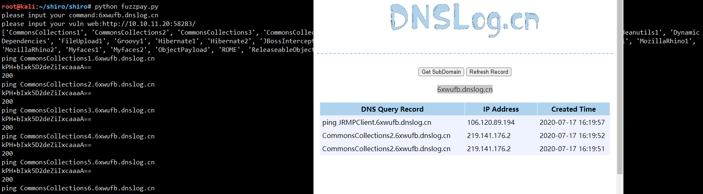
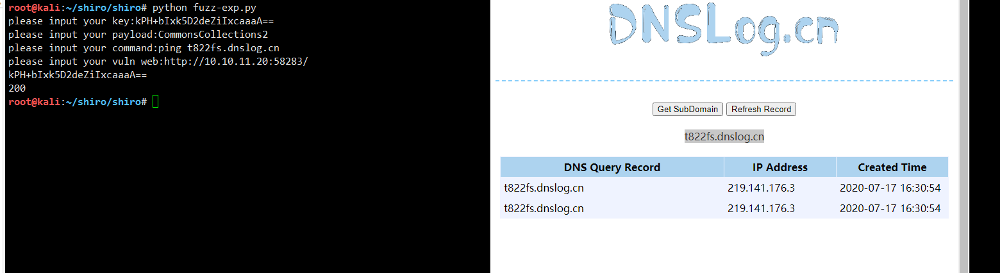

# shiro-exp

fuzzkey.py使用JRMPClient进行遍历收集的100个key。

fuzzpay.py遍历所有的利用链

fuzz-exp.py进行命令执行

使用：
1、python fuzzkey.py

填写dnslog和目标地址

2、python fuzzpay.py

根据fuzzkey拿到的key，填入fuzzpay中

填写dnslog和目标地址

3、python fuzz-exp.py

根据1和2得到可用的key和利用链填入

填写key、利用链、所执行的命令、目标地址

  
